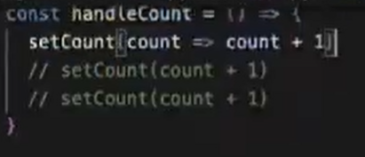

### JSX


添加样式：

style={{}}


calssName

react hook


vue基于html ，css， js开发， react使用jsx

react过去的class组件极其复杂

react需要手动优化性能

### useState语法

```
const [state, dispatch] = useState(initData);

state定义的数据源，可视作函数组件的内部变量，只在首次渲染被创造
dispatch 改变state的函数， 推动函数渲染的渲染函数 。dispatch有两种情况 非函数和函数
initData: state的初始值， initData有两种情况-非函数和函数
```

注意对象和数组的更新


如果一次更新函数里面有多个set函数，react会批处理合并更新，只执行最后一次， 要想都执行就用setTimeout


initData使用函数





react18中对连续的dispatch函数会批量更新， 就是在只重新渲染一次的 情况下把这些函数全部执行一次

可以用flushSync强制同步（就是执行一次渲染一次）， 但是flushSync的里面也会批处理更新


同步更新类似于刷新，更新一个内容要把所有的内容都刷新一遍。而异步则只刷新更新或修改的部分，不重新将所有内容全部刷新一遍。异步可以减少服务器的压力和等待时间。

### useEffect

语法

```
useEffect(effectFn, deps)
```


useEffect Hook相当于componnetDidMount, componentDidUpdate 和 componentWillUnmount

可以模拟渲染后， 更新后， 销毁三个动作

案例演示

1.渲染后更新标题

```
useEffect(() => {
	document.title = 'react后台课程'
}) //后面不给依赖项只要状态发生变化就会执行useEffect
```

2.渲染后更新count值

```
const [count, setCount] = useState(0);

useEffect(() => {
	setCount(count+1)
}, [])

非常高频使用场景， 比如做分页， 页码发生变化就要执行一次
```

3.点击按钮， 更新name值

```
const [total, setTotal] = useState(0);
const [count, setCount] = useState(0);
useEffect(() => {
	setTotal(count*5);
}, [count])
```

4.销毁定时器

```
const [count, setCount] = useState(0);
useEffect(()=> {
	const T = setInterval(() => {
	setCount(count => count+1);
	}, 3000)
	
	return () => {
	clearIntercal(T);
	}
})
```

```
const [count, setCount] = useState(0);
useEffect(()=> {
	const T = setInterval(() => {
	setCount(count+1);
	}, 3000)
})
//这里会每次都更新，因为没有依赖项， 每次状态更新都会重新渲染useEffect


const [count, setCount] = useState(0);
useEffect(()=> {
	const T = setInterval(() => {
	setCount(count+1);
	}, 3000)
}, [])
//这里只会更新一次加一， 因为闭包count只有第一次的值（就是依赖项没有值，只会依赖第一次渲染的 值）
```

自定义hook

使用use开头


### memo， useMemo, useCallback

memo组件缓存

useMemo值的缓存

useCallback函数缓存


被memo包裹的组件， 只要传入的属性不变， 组件就不会被重新渲染


那么当传入属性是函数时如何保证传入属性不变？

将函数用useCallback缓存


### useContext , useReducer

react中传递数据只能用单向数据流


这样传递数据是十分麻烦的

用createContext创建上下文

然后进行包裹

在被包裹的组件中使用useContext使用


useReducer


可以用useContext和useReducer结合在兄弟组件间改变值

就是将值和dispatch函数作为参数传递给context


### useRef

用useRef返回的对象然后访问current就能访问对象

可以使用对象的各种属性 focus(), blur(), value, className


### useTransition

主要是对包裹 部分进行降级，后渲染

这样就能保证先渲染优先级高的部分，优化用户体验


### React调试


console.time()是用来统计程序运行时间


while循环性能比for好

console.count()判断组件被执行多少次


进入

断点调试

可以用ctrl+p 快速查找要访问的文件


这几个分别是 跳过当前断点， 下一步， 进入（函数）

添加条件断点


要在控制台打印出DOM节点， 只要在源代码中点击选中当前节点然后在控制台$0就行

在打断点调试中， 要想在控制板台访问这个断点时刻的某个属性， 可以在控制台直接输入该属性名，或者copy()该属性名， 然后ctrl+V粘贴， 这样就能在控制台显示属性名了


