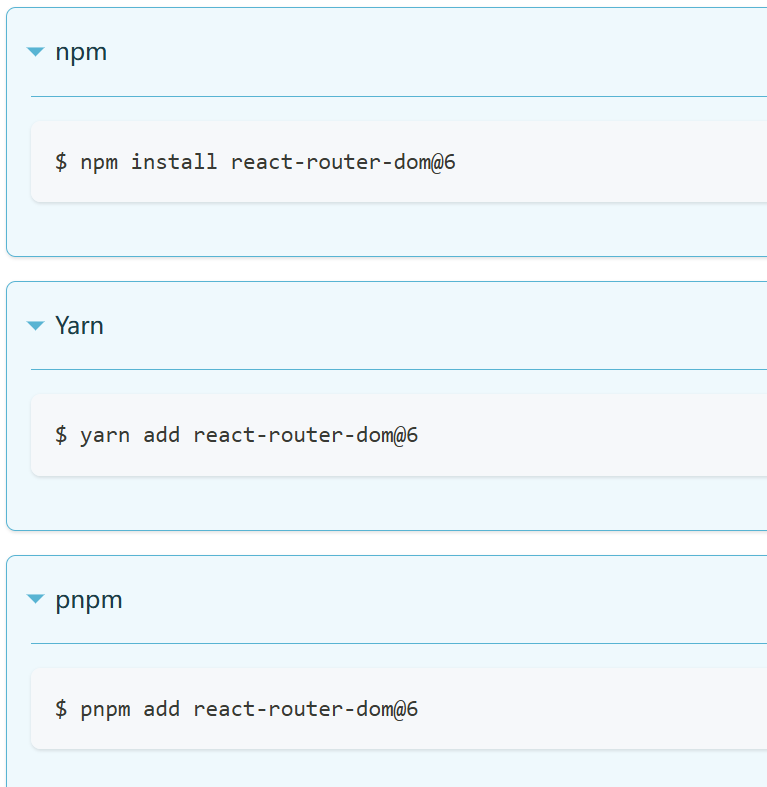
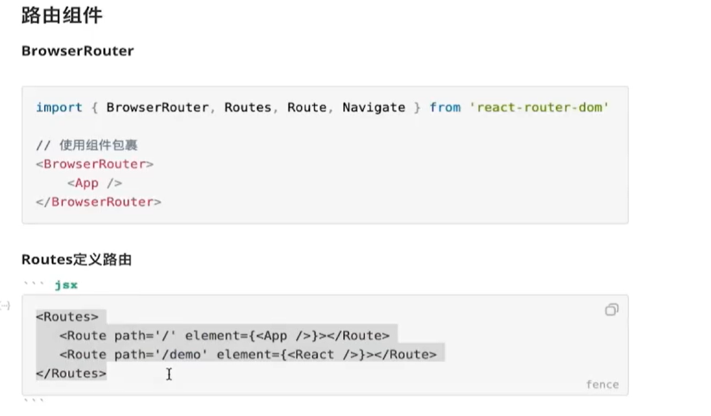
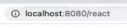
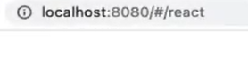
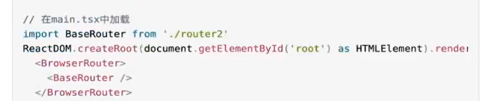
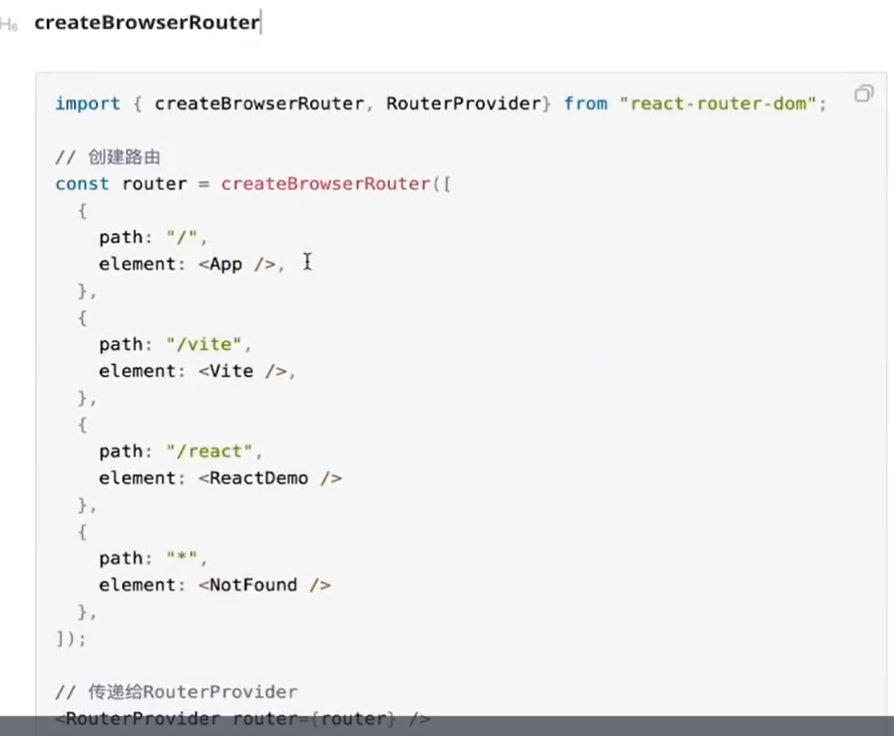
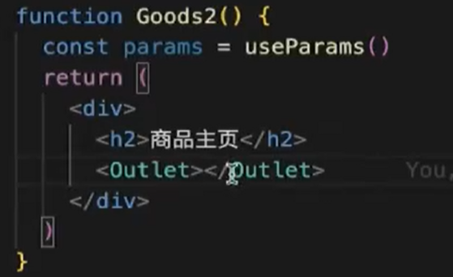

中文文档

[安装 | react router v6 中文文档](https://reactrouter.cn/docs/getting-started/installation)

为什么要学路由？

单页面应用程序， 依赖路由跳转

react只是一个视图层的框架

### 路由组件

History路由

Hash路由

Memory路由（很少使用）

内置组件

Navllink, link, outlet, route, routes

编程式导航组件Navigate, Hook导航 useNavigate

路由API 

createBrowserRouter

createHashRouter

动态路由， 嵌套路由

Data API (action , loader)

路由Hook（useRoutes, useNavigate, useParams)

路由懒加载

安装和使用






BrowserRouter


访问方式



hashRouter


访问方式



### 路由跳转

使用

NavLink

```tsx
<NavLink to="/react"></NavLink>
```

Link

```tsx
<Link to="/react"></Link>
//可以在to中输入..进入上一级
```


Navlink和Link功能上一样， 就是场景不同， Navlink在导航菜单里面， Link在普通组件中


Navigate重定向组件

```tsx
//路由中使用
<Route path='/vite' element={<Navigate to={'/react'} />}></Route>

//组件中使用
function Vue(){
    return <h2>欢迎学习Vue课程{<Navigate to={'/react'}/>}</h2>
}
```


Hook - useNavigate

```tsx
//前提必须在函数组件中定义
const navigate = useNavigate()

//点击按钮进行跳转
navigate('/react')
```


404定义

```tsx
<Route path='*' element={<NotFound></NotFound>} ></Route>
```

### API创建路由


useRoutes

```tsx
function Router() {
    let element = useRoutes([
        {
            path:"/",
            element:<App />,
        },
        {
            path:"/vite",
            element:<Vite />,
        },
        {
            path:"/react",
            element:<ReactDemo />,
        },
        {
            path:"*",
            element:<NotFount />,
        },
    ])
    
    return element;
}

export default Router;

// 在main.tsx中加载

```




createBrowserRouter(createHashRouter也是一样的)




### 动态路由，嵌套路由

basename

基础路由地址

```tsx
{
    basename: '/app'
}

//放在createBrowser后面，
```


动态路由

```tsx
{
    path: '/order/:orderId',
    element: <Order/>
}

{
    path: '/goods/:goodsId/order/:orderId',
    element: <Order/>
}


function Order(){
    const params = useParams();
    return <div>
    	<h2>商品组件</h2>
        <p>
        	<span>商品ID: {params.goodsId}</span>
            <span>订单ID: {params.orderId}</span>
        </p>
    </div>
}
```

嵌套路由

```tsx
{
    path
}
```


子路由中的地址不能添加/， 不然就是根路由了

不添加/， 父路由会自动拼接zi

outlet

用来放置子组件在父组件中的位置

