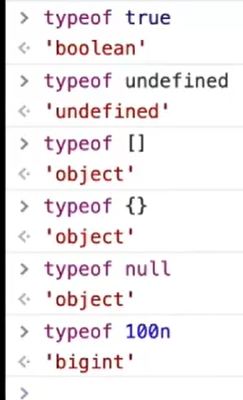
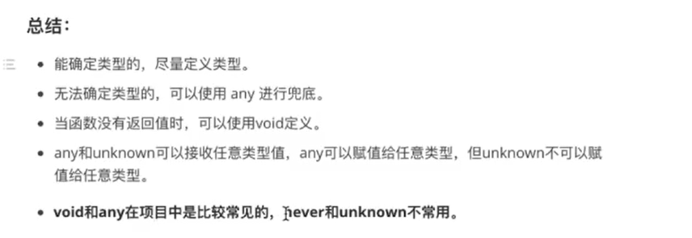
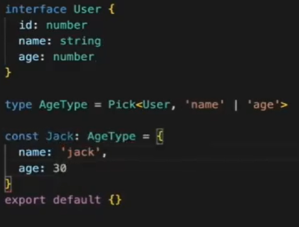
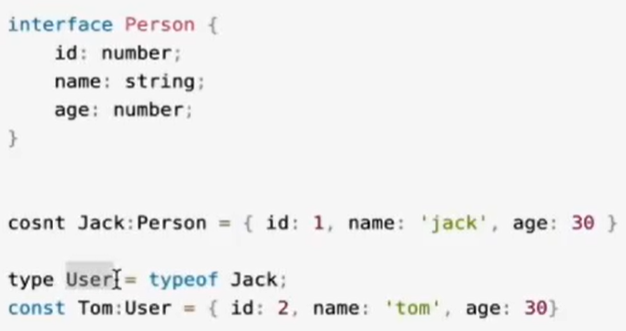
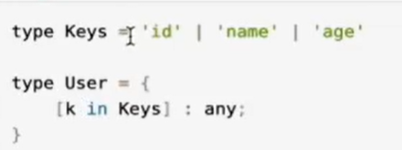
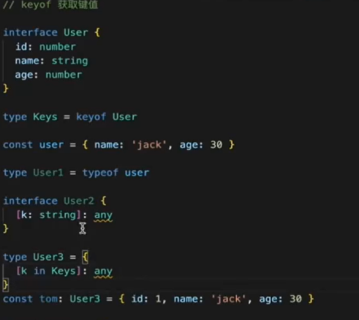
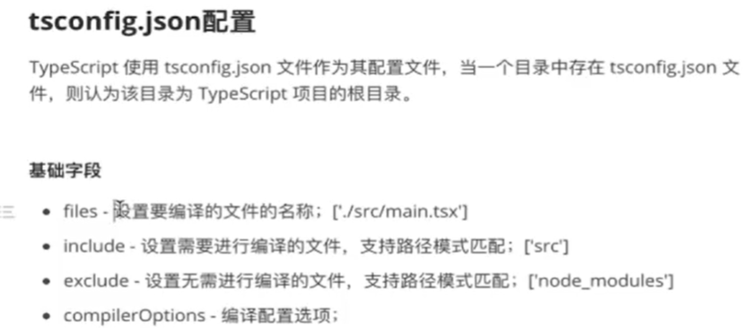
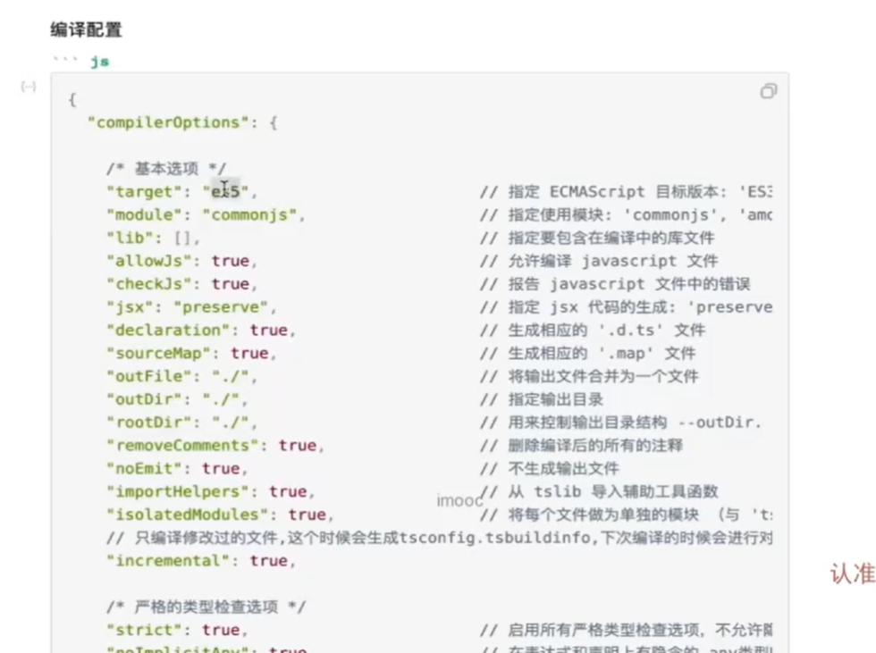
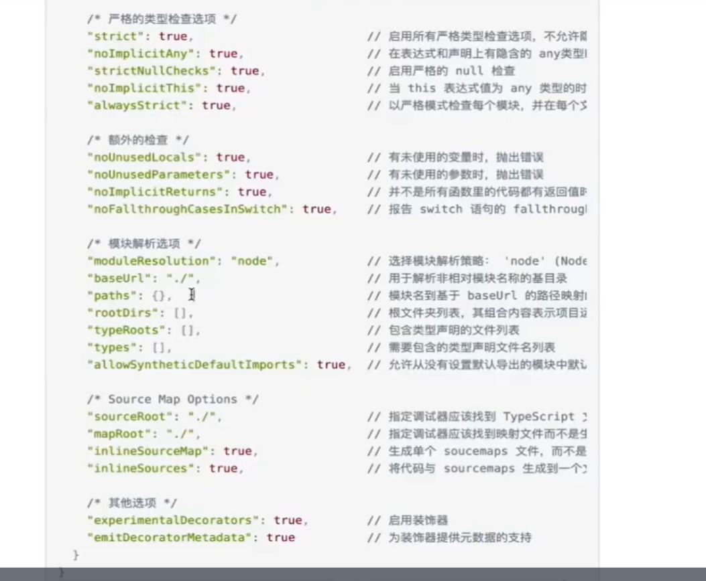

TS是js的超集

TS对应八种数据类型

特殊类型void never any known

Array , 函数 ， 元组

类型推断

类型断言

联合类型

类型别名

交叉类型

接口(interface)

泛型

tsconfig.json配置

在js中可以用typeof判断一个数据的类型



ts中默认字符串类型的类型名会被自动删掉， 当然也可以保留,这是因为ts的自动类型推导

### ts基本数据类型

```ts
const name:string = 'jack';
const age:number = 30;
const isTrue:boolean = true;
let a:undefined;
const b:null = null;
const user:object = {};
const big:bigint = 100n;
const sym:symbol = Symbol('haha');

```

### void类型

void表示没后任何类型， 不能直接赋值

```
let a: void;
let b: number = a;//报错
```

给变量赋值为void是没有意义的

如果一个函数没有返回值， 可以定义为void

```ts
function fn():void{
    console.log('今天天气不错')
}

<a href="javascript:void;"></a>
```

### never类型

never表示永不存在的值的类型

```ts
//抛出异常
function fn():never {
    throw new Error('我是被一个Error')
}

//死循环
function loop():never {
    while(true){
        console.log('这里是死循环')
    }
}
```

### any类型

any类型表示任意类型

```ts
let num:number = 1000;
num = "jack"; //报错
let num:any = 1000;
num = "jack"; //不报错
//调用方法， 依然不报错
num.setNum('jack');
```

虽然any不做任何约束， 但是不建议使用， 这样会带来巨大隐患

我们在开发组件， 模块， 定义函数， 调用接口时， 如果类型很难定义， 不知道属于什么类型等场景， 可以适当使用any

### unknown类型

unkonwn和any一样， 所有类型的值都可以被分配给unknown， 但是unknow的值不能给其他类型，会报错

```
//unknown接受任意类型
let name:string = "jack";
let user:unknown = "jack";

//unknown不能赋值给其他类型， any除外， 下面会报错
let name:unknown = "jack";
let user:string = name//这样就报错了
```



### 数组和函数类型的 定义

```ts
const list1:number[] = [1, 2, 3];
const list2:Arrray<number> = [1,2,3];
const list3:[number, string, boolean] = [1, '2', true];
const list4:[{name:string; age:number}] = [{name:"jack", age:30}];
const list5:Array<{name:string; age:number}> = [{name:"jack", age:30}];
interface User {
    name:string
    age:number
}

const list6:Array<User> = [{name:"jack", age:30}];
 
```


函数类型定义

```ts
function add1(a:number, b:number):number{
	return a+b;
}

function add2(a:number, b:number):void{
    console.log(a+b);
}

function add3(a:number, b:number):unknown{
    throw new Error('Error');
}

const add4 = (a:number, b:number):number =>{return a+b}
const add5:(a:number, b:number)=> number = (a, b) => {
    return a+b;
}
```


###   元组

数组一般有同类型的值组成， 但有时存在多种类型， 被称为元组

数组定义:同一类型

元组定义：不同类型

```
const list:[number, string, boolean] = [1, '2', true];

//解构
const user:[number, string]
const [id, name] = user;

//可选类型
const list:[number, number, number?] = [1, 2, 3];
const list:[number, number, number?] = [1, 2];
```


### 联合|   交叉&类型

把多个类型合并为一个类型， 称为交叉类型

```
//js中使用且
const coun = 10;
if(count > 0 && count < 10) console.log('执行代码')

//TS中也有类似写法。 先看或的使用
1.或使用
let id = 1;
let id = '1';

let id:number|string = 1;
```

那且如何使用？一个变量不可能既是数字又是字符串

```
//错误用法
let id: number & string=1;

//正确用法
type UserType = {id:number, name:string}
type AgeType = {age: number};

const user: UserType & AgeType = {id:1, name:'jack', age:30}
```

### 接口

java中接口是对行为的抽象，具体功能由类负责实现

TS中， 接口是一个灵活的概念， 除了用于抽象以外， 还可以用于类型的描述

```ts
interface Person {
    name:string;
    age:number;
}

const jack:Person = {
    name:'jack',
    age: 30
}

//少字段会报错
const tom:Person = {
    name: "Tom",
}

//多字段也会报错
const tom:Person = {
    name: "Tom",
    age:30,
    money: 100
}

```

接口一般首字母大写

属性可以只读或可选

```ts
interface Person {
    readonly name:string;
    age?:number;
}

//正确
const tom:Person = {
    name:'tom'
}

//错误, 报错
tom.name = 'jack'
```


任意属性

比如说我们不确定用户具体有哪些属性， 怎么去定义类型

```ts
interface Person {
    name:string;
    age:number;
    [k:string] : string|number; //这里不能用单一类型，会冲突，要是上面所有类型的父类型，可以用交叉类型
}
```


定义函数类型

```ts
const add = (x, y)=> {
    return x+y
}

//添加类型
const add = (x:number, y:number):number => {
    return x+y;
}

//接口定义函数类型
interface Sum{
    (x:number, y:number):number;
}

const add: Sum = (x, y) => {
    return x + y
}

//type定义函数类型
type Sum = (x:numberm, y:number)=>number;
```


接口继承

```ts
interface U {
    id:number;
    name: string;
}

interface Person extends U {
    age: number;
}

const tim：Person {
    id: 1,
    name:'tim',
    age: 30
}

type U1 = {id:number; name: string}
type Person1 = {age:number} & U1
```

接口和type区别

接口通过interface定义， type是用来定义类型别名

接口可以重复定义(同名接口内容会合并)， type不可以继承， 到那时可以使用联合类型和交叉类型来模拟继承


### 泛型

在编译期间不确定变量的类型。 在调用时，由开发者指定具体的类型

场景1： 如何给arg参数和函数指定类型

```ts
function identity(arg) {
    return arg
}

//定义时无法确定类型， 只有在调用的时候才能确定参数类型
function identity<T>(arg:T):T{
    return arg;
}

identity<number>(1)
identity<string>('jack')
```

场景2：多个类型传递

```ts
function identity<T,U>(x:T, y:U):T {
    return x;
}

identity<number, number>(1, 2);
identity<string, number>('a', 2);
```

回顾一下任意属性

```ts
interface Person{
    [k:string]:string;
}
```

任意属性是不确定有什么属性。 泛型是不确定有什么类型


场景3： Pick使用



### keyof , typeof 和in

keyof

JS中获取key的语法： Object.keys()

TS中获取key的类型： keyof

```ts
interface Person {
	id: number;
	name: string;
	age: number;
}

type K1 = keyof Person; //'id' | 'name' | 'age'
```

typeof



in





### tsconfig.json配置





